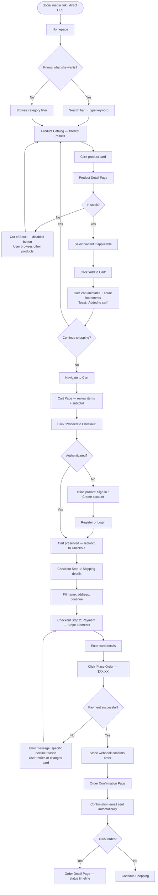
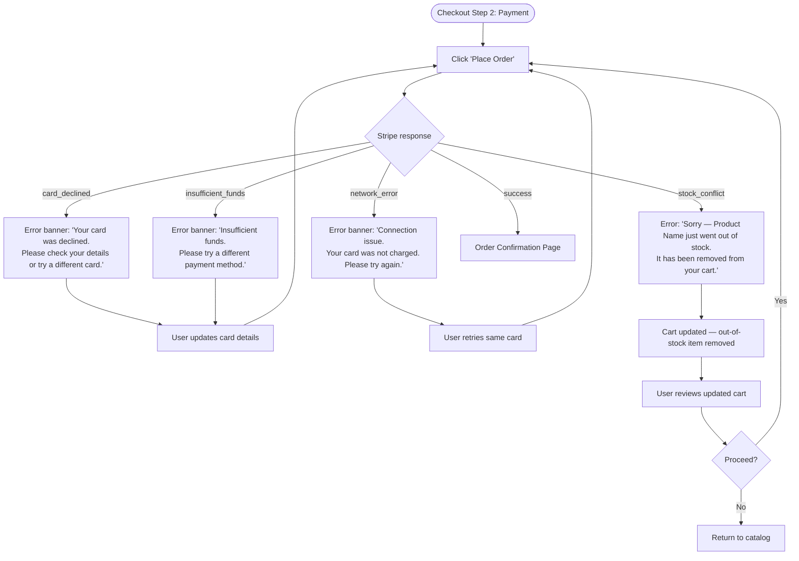
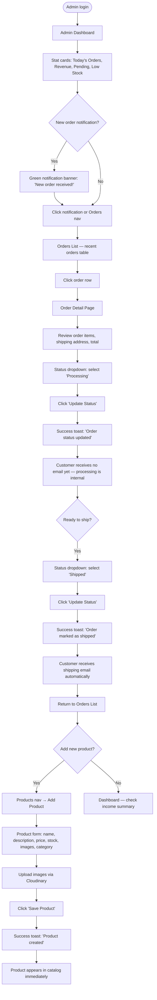
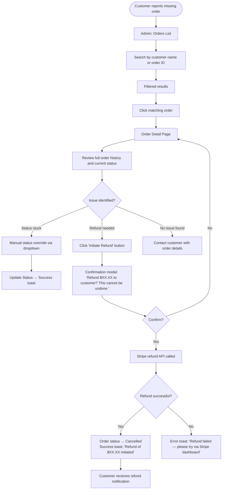
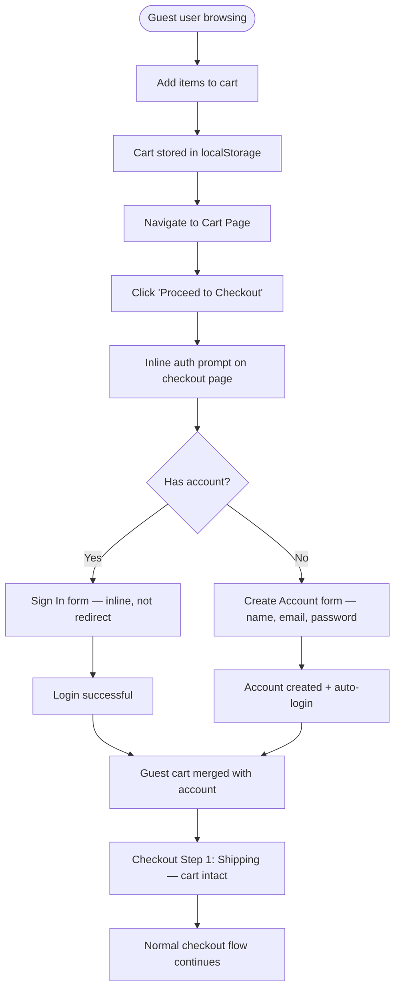

---
stepsCompleted:
  - step-01-init
  - step-02-discovery
  - step-03-core-experience
  - step-04-emotional-response
  - step-05-inspiration
  - step-06-design-system
  - step-07-defining-experience
  - step-08-visual-foundation
  - step-09-design-directions
  - step-10-user-journeys
  - step-11-component-strategy
  - step-12-ux-patterns
  - step-13-responsive-accessibility
  - step-14-complete
status: complete
inputDocuments:
  - _bmad-output/planning-artifacts/prd.md
  - _bmad-output/planning-artifacts/architecture.md
  - _bmad-output/planning-artifacts/epics.md
---

# UX Design Specification — simple-ecommerce

**Author:** Aditya
**Date:** May 3, 2026

---

## Executive Summary

### Project Vision

simple-ecommerce is a production-quality MERN storefront for selling physical goods online — built by its first seller, for real customers, from day one. It is not a tutorial clone or a mock store. The UX must reflect that: trustworthy, fast, and purposeful. Two audiences share the platform but experience it completely differently: customers who browse and buy, and a single owner-operator who manages everything.

### Target Users

**Priya — The Customer**
Discovers the store via social media. Mobile-first. Not necessarily tech-savvy — she just wants to find what she needs and buy it without friction. She expects a fast, trustworthy experience: clear product information, transparent pricing, a checkout that feels safe, and post-purchase communication that keeps her informed. She becomes a repeat customer if the experience earns her trust.

**Aditya — The Owner-Operator (Admin/Seller)**
The sole admin and seller. Manages products, inventory, orders, and fulfillment from a unified dashboard. Needs real-time visibility into store activity — new orders, pending fulfillments, revenue at a glance. The admin UX is purpose-built for one person: focused, calm, and efficient. Not a generic multi-vendor marketplace interface.

### Key Design Challenges

1. **Trust at checkout** — Priya is buying from a store she likely found via social media. The UX must build trust quickly: clear product information, visible stock status, transparent pricing, and a checkout flow that feels professional and safe.

2. **Guest-to-authenticated transition** — Cart persists for guests, but checkout requires login. The moment of "you need an account" is a classic drop-off point. Registration must feel like a natural, low-friction step — not a wall.

3. **Admin information density** — Aditya needs today's orders, revenue, pending fulfillments, and new-order notifications at a glance. The challenge is surfacing the right information without overwhelming a single-person operation.

### Design Opportunities

1. **Order tracking as a delight moment** — Real-time order status (even via polling) is a chance to make Priya feel genuinely cared for. A well-designed order detail page with a clear status timeline can be a standout feature for a small store.

2. **Product detail page as the conversion engine** — With a single seller, every product page is a sales pitch. Great image presentation, clear stock urgency, and well-placed reviews can drive conversion without extra features.

3. **Admin as a calm, focused workspace** — A one-person operation doesn't need an enterprise dashboard. A clean interface that surfaces what matters (new orders, low stock, pending fulfillments) can feel genuinely pleasant to use every day.

## Core User Experience

### Defining Experience

The core experience of simple-ecommerce is built around two distinct loops:

**Customer loop:** Discover → Evaluate → Buy → Track. Every design decision should reduce friction in this loop. The product detail page is where evaluation happens; checkout is where trust is tested; order tracking is where loyalty is built.

**Admin loop:** See → Act → Confirm. Aditya needs to know what's happening in his store at a glance, take action (update status, manage products, handle issues), and trust that the system has communicated with his customers on his behalf.

The most critical interaction to get right is **checkout** — it is the moment where trust is tested and money changes hands. A confusing or broken checkout doesn't just lose a sale; it loses a customer permanently.

### Platform Strategy

- **Primary platform:** Mobile-first responsive web (React SPA)
- **Input modality:** Touch on mobile, mouse/keyboard on desktop
- **Rendering:** Client-side rendering (CSR) — loading states must be handled gracefully throughout; skeleton screens and spinners are first-class UI elements, not afterthoughts
- **No offline requirement** — but network errors must be handled with clear, recoverable messaging
- **Touch targets:** Minimum 44px on all interactive elements (PRD requirement)
- **Breakpoints:** Mobile < 768px, tablet 768–1024px, desktop > 1024px

### Effortless Interactions

These interactions must require zero cognitive effort from the user:

- **Add to cart** — one tap/click, immediate visual feedback, no page navigation required
- **Cart persistence** — guest cart survives page refresh and browser close without any user action
- **Login during checkout** — the transition from guest to authenticated should feel like a continuation, not an interruption; cart contents must survive the login
- **Order status updates** — status changes appear without the user needing to refresh; the page updates itself
- **Token refresh** — session continuity is invisible; users are never unexpectedly logged out mid-flow

### Critical Success Moments

These are the make-or-break moments in the user experience:

| Moment | User | What must happen |
|---|---|---|
| Order confirmation page loads | Priya | Clear confirmation, order number, summary — she knows it worked |
| Shipping email arrives | Priya | She feels cared for; the store is real and attentive |
| New order notification fires | Aditya | Immediate awareness; the store feels alive |
| Order status updated → customer notified | Aditya | He acts once; the system handles communication |
| Card declined at checkout | Priya | Clear, specific error — not a generic crash; she can retry |
| Out-of-stock at checkout | Priya | Honest, immediate feedback with the specific product named |

### Experience Principles

These principles guide every UX decision in simple-ecommerce:

1. **Trust is earned in details** — Small things signal professionalism: consistent spacing, clear error messages, visible stock status, a checkout that looks like it belongs to a real store. Every detail either builds or erodes Priya's confidence.

2. **Fewer steps, more confidence** — Every unnecessary step between "I want this" and "I bought this" is a drop-off risk. Reduce steps ruthlessly, but never at the cost of clarity or trust.

3. **The system communicates so Aditya doesn't have to** — When Aditya updates an order status, the customer is notified automatically. When a new order arrives, Aditya knows immediately. The admin UX is a force multiplier for one person running a real store.

4. **Errors are recoverable, not catastrophic** — Payment failures, stock issues, and network errors must present clear, specific, actionable messages. Users should always know what happened and what to do next.

5. **Loading is part of the experience** — CSR means users will see loading states. Skeleton screens and spinners must be designed intentionally, not bolted on. A well-handled loading state maintains trust; a blank screen destroys it.

6. **Follow established e-commerce patterns** — Users have internalized patterns from modern stores (Shopify storefronts, DTC brands, major retailers). Sticky header with cart count, product grid with hover states, checkout progress indicator, order status timeline — these patterns reduce cognitive load because users already know them.

## Desired Emotional Response

### Primary Emotional Goals

**For Priya (Customer):**
The primary emotional arc is: *Curiosity → Confidence → Satisfaction → Loyalty*. She arrives uncertain, the experience builds her trust, the purchase delivers satisfaction, and the post-purchase care earns her return.

**For Aditya (Admin):**
The primary emotional arc is: *Awareness → Control → Efficiency*. He opens the dashboard knowing what's happening, acts decisively, and trusts the system to handle the rest.

### Emotional Journey Mapping

| Stage | Priya feels | Aditya feels |
|---|---|---|
| First arrival / homepage | Curious, evaluating | — |
| Browsing catalog | Engaged, in control | — |
| Product detail page | Informed, reassured | — |
| Checkout | Confident, safe | — |
| Order confirmation | Relief, satisfaction | Excited (new order notification) |
| Order tracking | Cared for, informed | Efficient, trusted |
| Error / problem | Frustrated but not abandoned | Calm, in control |
| Dashboard | — | Commanding, aware |
| Managing products/orders | — | Efficient, reliable |

### Micro-Emotions

**Critical positive micro-emotions to cultivate:**
- **Confidence** at checkout — every visual element signals "this is a real, safe store"
- **Delight** at order confirmation — the payoff moment; clear, warm, reassuring
- **Satisfaction** when cart updates instantly — immediate feedback on every action
- **Trust** from visible stock status — honesty about availability builds credibility
- **Excitement** for Aditya when a new order notification fires — the reward of a real sale

**Negative micro-emotions to eliminate:**
- **Skepticism** — caused by inconsistent design, missing information, or an unpolished checkout
- **Anxiety** — caused by unclear payment status, missing confirmation, or silent errors
- **Confusion** — caused by unclear navigation, missing breadcrumbs, or ambiguous CTAs
- **Overwhelm** — caused by information-dense admin screens without clear hierarchy

### Design Implications

| Emotional goal | UX design approach |
|---|---|
| Trust at first impression | Clean, consistent layout; professional typography; real product photography; no visual clutter |
| Confidence at checkout | Stripe Elements (familiar, trusted UI); visible security indicators; clear step progress; no surprise fees |
| Relief at order confirmation | Dedicated confirmation page (not just a toast); order number prominent; clear "what happens next" |
| Cared for during tracking | Order status timeline (vertical stepper); status updates without page refresh; proactive email notifications |
| In command on admin dashboard | Stat cards above the fold; data tables with clear actions; new order badge/notification prominent |
| Efficient in admin operations | Inline editing where possible; confirmation modals only for destructive actions; success feedback immediate |
| Not abandoned during errors | Specific, human-readable error messages; clear recovery path; never a blank screen or generic "something went wrong" |

### Emotional Design Principles

1. **Every confirmation is a relationship moment** — Order confirmation, shipping notification, status update — these are not just system messages. They are the store talking to a customer. Tone should be warm, clear, and human.

2. **Silence creates anxiety** — Any action without immediate feedback (adding to cart, submitting payment, saving a product) creates doubt. Every action must have an immediate visual response, even if the async operation is still in flight.

3. **Trust is visual before it is functional** — Priya decides whether to trust the store before she reads a single word of product description. Typography, spacing, image quality, and color consistency communicate professionalism in milliseconds.

4. **The admin dashboard is a daily ritual** — Aditya will open this every morning. It should feel like a calm, reliable workspace — not a stressful command center. Information hierarchy matters more than information density.

5. **Delight lives in the details** — Smooth transitions, micro-animations on cart updates, a well-timed success toast, a status timeline that feels alive — these small moments accumulate into an experience that users remember and recommend.

## UX Pattern Analysis & Inspiration

### Inspiring Products Analysis

**Shopify DTC Storefronts (Allbirds, Gymshark, MVMT)**
The benchmark for independent e-commerce. Key patterns: sticky header with cart count, product grid with hover-reveal second image and quick-add, split-layout product detail page (gallery left, purchase panel right), pill-button variant selectors, breadcrumb navigation, low-stock urgency messaging, sticky mobile CTA bar.

**Amazon**
The reference for trust signals and information architecture. Key patterns: star rating + review count on product cards, stock status always visible before add-to-cart, order confirmation with large order number and estimated delivery, order history as scannable list with status badges.

**Stripe Checkout**
The standard for payment UX trust. Key patterns: Stripe Elements UI (already trusted by users), checkout progress indicator (Shipping → Payment → Review), persistent order summary sidebar on desktop, collapsible order summary on mobile.

**Shopify Admin**
The reference for single-operator store management. Key patterns: stat cards at top (sales, orders, revenue), recent orders table immediately below, sidebar navigation with clear sections, color-coded status badges on orders, bulk actions on tables.

**ASOS / Zara**
Mobile-first catalog UX reference. Key patterns: 2-column product grid on mobile, filter drawer sliding in from side (no page navigation), sort control in top bar, pagination over infinite scroll for simplicity and SEO.

### Transferable UX Patterns

**Navigation Patterns:**
- Sticky header: logo left, nav links center (desktop), cart icon + count right — universal e-commerce convention
- Mobile: hamburger menu opens full-screen drawer; bottom of screen reserved for sticky CTA on product/cart pages
- Breadcrumbs on product detail pages: Home > Category > Product Name

**Product Catalog Patterns:**
- 3-column grid desktop / 2-column tablet / 2-column mobile
- Product card: image (with hover second image on desktop), product name, price, star rating + review count
- Quick-add to cart button appears on card hover (desktop only)
- Filter drawer slides in from left on mobile; filter panel visible on left sidebar on desktop
- Sort dropdown in top bar; active filter chips shown below search bar
- Pagination with page numbers (not infinite scroll)

**Product Detail Page Patterns:**
- Split layout: image gallery left (60%), purchase panel right (40%) — sticky on desktop scroll
- Image gallery: main image large, thumbnail strip below; click to zoom
- Variant selectors as pill buttons (size, color) — not dropdowns
- Stock status: "In Stock" (green) / "Only X left" (amber, when ≤5) / "Out of Stock" (red, button disabled)
- Sticky "Add to Cart" bar appears when main CTA scrolls out of view on mobile
- Reviews section below the fold: average rating, star distribution bar chart, individual reviews

**Checkout Patterns:**
- 3-step progress indicator: Shipping → Payment → Review
- Order summary sidebar visible throughout on desktop; collapsible on mobile
- Stripe Elements for card input — no custom card UI
- Clear "Place Order" CTA with total amount on the button
- No account required to reach checkout; login/register prompt is inline, not a redirect wall

**Order & Post-Purchase Patterns:**
- Dedicated order confirmation page (not just a toast): large order number, summary, estimated delivery, "what happens next"
- Order history: list view with order number, date, status badge, total, "View Details" link
- Order detail: vertical status timeline stepper (Placed → Processing → Shipped → Delivered)
- Status badges: color-coded (yellow = pending, blue = processing, purple = shipped, green = delivered)

**Admin Dashboard Patterns (Shopify Admin-inspired):**
- Stat cards row at top: Today's Orders, Total Revenue, Pending Fulfillments, Low Stock Items
- Recent orders table immediately below stats
- Sidebar navigation: Dashboard, Orders, Products, Settings
- Color-coded order status badges throughout
- Product list as data table with image thumbnail, name, price, stock, actions
- Bulk status update on order tables

### Anti-Patterns to Avoid

- **Mandatory account creation before checkout** — guest cart + inline login prompt is the correct pattern
- **Checkout without progress indicator** — users abandon when they don't know how many steps remain
- **Generic error messages** — "Something went wrong" is never acceptable; always name the specific problem
- **Cart as a dead end** — always provide "Continue Shopping" and a clear path forward from an empty cart
- **Modals for non-destructive actions** — reserve confirmation modals for delete/refund only; use toasts for success feedback
- **Admin tables without search/filter** — unusable at scale; every data table needs at minimum a search input
- **Dropdowns for variant selection** — pill buttons are faster to scan and tap; use dropdowns only when options exceed ~8
- **Full-page navigation for mobile filters** — filter drawer is the correct pattern; never navigate away from the catalog to filter

### Design Inspiration Strategy

**Adopt directly:**
- Sticky header with cart count (universal convention)
- 2-column mobile / 3-column desktop product grid
- Split-layout product detail page
- Stripe Elements for payment (no custom card UI)
- 3-step checkout progress indicator
- Vertical order status timeline stepper
- Shopify Admin-style stat cards + recent orders table

**Adapt for this project:**
- Shopify Admin sidebar navigation → simplified for single-seller (fewer sections needed)
- Amazon order history → streamlined (no returns/replacements complexity for MVP)
- DTC quick-add on hover → implement on desktop; on mobile, card tap goes to detail page

**Avoid entirely:**
- Infinite scroll (use pagination — simpler, better for this project's scope)
- Complex filter systems (category filter + sort is sufficient for MVP)
- Mandatory account creation gate before checkout

## Design System Foundation

### Design System Choice

**Selected approach: Custom component library built on Tailwind CSS v4 + Radix UI primitives, following shadcn/ui patterns**

This is the modern professional standard for React + Tailwind projects. Components are owned in the codebase (not a black-box dependency), styled entirely with Tailwind, and built on Radix UI's accessible headless primitives. The result looks exactly as designed — no imposed visual opinions from a component library.

### Rationale for Selection

- **Tailwind CSS v4 is already in the stack** — adding a component library with its own styling system (MUI, Chakra) would create conflicts and bundle bloat
- **shadcn/ui patterns are the 2025–2026 standard** for React + Tailwind projects — used by Vercel, Linear, and the majority of modern SaaS products
- **Full visual control** — the store needs to look like a real, branded e-commerce store, not a generic Material Design or Ant Design app
- **Accessibility included** — Radix UI primitives handle keyboard navigation, focus management, ARIA attributes, and screen reader support out of the box
- **No bundle overhead** — components live in the codebase; only what's used is shipped
- **Portfolio quality** — custom-styled components demonstrate real design and engineering skill

### Implementation Approach

The existing UI components (`Button`, `Input`, `Modal`, `Toast`, `Spinner`, `Pagination`, `StarRating`) are built following shadcn/ui patterns:
- Tailwind utility classes for all styling
- `class-variance-authority` (cva) for variant management (e.g., Button variants: primary, secondary, destructive, ghost)
- `clsx` / `cn()` utility for conditional class merging
- Radix UI primitives for complex interactive components (Modal/Dialog, Select, Dropdown, Tooltip)

### Customization Strategy

**Design tokens (defined as Tailwind CSS custom properties):**
- Brand colors: primary, secondary, accent, neutral scale
- Typography scale: font family, size scale, weight scale
- Spacing scale: consistent 4px base grid
- Border radius: consistent rounding (e.g., `rounded-md` for cards, `rounded-full` for badges)
- Shadow scale: subtle elevation for cards and modals

**Component variants to define:**
- Button: `primary` (filled), `secondary` (outlined), `ghost` (text-only), `destructive` (red, for delete/refund)
- Badge/Status: `pending` (yellow), `processing` (blue), `shipped` (purple), `delivered` (green), `cancelled` (red)
- Input: `default`, `error` (red border + error message), `disabled`
- Card: `product` (with hover state), `stat` (admin dashboard), `order` (order history)

## Core Interaction Design

### Defining Experience

**Customer defining experience: "Find it, buy it, done."**
The complete purchase flow — from product discovery to order confirmation — is the interaction that defines the customer experience. If Priya can find what she wants, add it to cart, and complete checkout in under 2 minutes with a confirmation email arriving immediately, the store has succeeded. This is what she'll tell a friend about.

**Admin defining experience: "See what's happening, act on it."**
The dashboard moment — opening the admin and immediately knowing the state of the store. New orders visible, revenue at a glance, pending fulfillments clear. Then acting: one click to update an order status, knowing the customer was automatically notified. One person, full control, no hunting.

### User Mental Model

**Priya's mental model:**
Priya has shopped on Amazon, Shopify stores, and major retail sites. She arrives with a fully formed mental model: browse grid → product detail → add to cart → checkout → confirmation. This model is non-negotiable — deviating from it creates friction and erodes trust. The design must execute this familiar flow flawlessly, not reinvent it.

Key expectations she brings:
- Cart icon in the header, always visible with item count
- Product images are large and zoomable
- Price is always visible before adding to cart
- Checkout asks for shipping first, then payment
- She gets a confirmation email immediately

**Aditya's mental model:**
Aditya has likely used Shopify Admin or similar store management tools. He expects: numbers at the top (today's sales, orders), a list of recent orders below, ability to click into any order and update its status. He expects the system to handle customer communication automatically when he acts.

### Success Criteria

**Customer purchase flow success:**
- Product found within 3 clicks from homepage (PRD requirement)
- Checkout completed in under 2 minutes from cart to confirmation (PRD requirement)
- Zero ambiguity at any step — user always knows what to do next
- Order confirmation page loads immediately after payment — no spinner anxiety
- Confirmation email arrives within 60 seconds of order placement

**Admin dashboard success:**
- Today's key metrics visible without scrolling on desktop
- New order notification visible within 30 seconds of order placement (polling interval)
- Order status update takes 2 clicks: find order → change status
- No confirmation required for non-destructive actions (status updates use immediate feedback)
- Confirmation required only for destructive actions (delete product, initiate refund)

### Novel vs. Established Patterns

**Assessment: Established patterns throughout — executed with quality.**

This is the correct approach for e-commerce. Users spending money do not want to learn new interaction paradigms. The competitive advantage is execution quality, visual polish, and reliability — not interaction novelty.

Established patterns adopted:
- Standard e-commerce navigation and layout conventions
- Stripe Elements for payment (users already trust this UI)
- Shopify Admin-style dashboard layout
- Amazon-style order history and status tracking

The one area of intentional polish above the baseline: **the order status timeline**. Rather than a simple text status, a visual vertical stepper (Placed → Processing → Shipped → Delivered) with timestamps and active state highlighting gives Priya a clear, satisfying sense of progress. This is established in pattern (used by FedEx, UPS, major retailers) but often absent from small stores — making it a genuine differentiator at this scale.

### Experience Mechanics

#### Customer: Add to Cart → Checkout → Confirmation

**1. Initiation (Product Detail Page):**
- User sees "Add to Cart" button — primary color, full-width on mobile, prominent on desktop
- Stock status visible above the button: "In Stock" / "Only 3 left" / "Out of Stock" (button disabled)
- One tap/click adds to cart — no page navigation

**2. Interaction (Cart feedback):**
- Cart icon in header animates (count increments with a subtle bounce)
- Toast notification slides in: "Added to cart — View Cart" (with link)
- User can continue browsing or navigate to cart

**3. Cart → Checkout transition:**
- Cart page shows all items, subtotal, "Proceed to Checkout" CTA
- If not authenticated: inline prompt "Sign in or create an account to continue" — not a redirect wall
- After auth: seamlessly continues to checkout with cart intact

**4. Checkout (3 steps):**
- Step 1 — Shipping: name, address fields; "Continue to Payment" CTA
- Step 2 — Payment: Stripe Elements card input; order summary sidebar; "Place Order — $XX.XX" CTA
- Step 3 — Confirmation: dedicated page, not a modal
- Progress indicator visible at top throughout

**5. Completion (Order Confirmation):**
- Dedicated page: "Order Confirmed! 🎉" heading
- Order number in large type: #12345
- Items summary, shipping address, total
- "What happens next": estimated processing time, shipping notification promise
- "Continue Shopping" link

#### Admin: Dashboard → Order Management

**1. Dashboard arrival:**
- 4 stat cards: Today's Orders, Total Revenue (all time), Pending Fulfillments, Low Stock Items
- Recent orders table below: order #, customer name, date, total, status badge, "View" link
- New order notification: badge on "Orders" nav item

**2. Order management:**
- Orders list: searchable, filterable by status and date range
- Click order → order detail page
- Status dropdown: select new status → "Update" button → immediate success toast
- Customer automatically notified (email) on "Shipped" status change

**3. Product management:**
- Product list: data table with thumbnail, name, price, stock quantity, edit/delete actions
- "Add Product" button → form with image upload, all fields
- Inline stock edit: click stock number → edit in place → save

## Visual Design Foundation

### Color System

**Design rationale:** Clean, neutral-dominant palette with a single confident accent. Inspired by modern DTC e-commerce brands (Allbirds, Everlane, Shopify storefronts). Lots of white space, near-black text, one primary color that carries all interactive weight. The palette communicates trust and professionalism without feeling corporate or cold.

**Primary palette:**

| Token | Value | Usage |
|---|---|---|
| `--color-primary` | `#111827` (Gray 900) | Primary CTAs, key headings, nav |
| `--color-primary-hover` | `#1f2937` (Gray 800) | Button hover states |
| `--color-accent` | `#2563eb` (Blue 600) | Links, focus rings, active states, badges |
| `--color-accent-hover` | `#1d4ed8` (Blue 700) | Accent hover |
| `--color-background` | `#ffffff` | Page background |
| `--color-surface` | `#f9fafb` (Gray 50) | Card backgrounds, input backgrounds |
| `--color-border` | `#e5e7eb` (Gray 200) | Dividers, card borders, input borders |
| `--color-text-primary` | `#111827` (Gray 900) | Body text, headings |
| `--color-text-secondary` | `#6b7280` (Gray 500) | Subtext, labels, placeholders |
| `--color-text-muted` | `#9ca3af` (Gray 400) | Disabled text, hints |

**Semantic / status colors:**

| Token | Value | Usage |
|---|---|---|
| `--color-success` | `#16a34a` (Green 600) | "In Stock", delivered status, success toasts |
| `--color-success-bg` | `#f0fdf4` (Green 50) | Success badge background |
| `--color-warning` | `#d97706` (Amber 600) | "Only X left", pending status |
| `--color-warning-bg` | `#fffbeb` (Amber 50) | Warning badge background |
| `--color-error` | `#dc2626` (Red 600) | "Out of Stock", error states, destructive actions |
| `--color-error-bg` | `#fef2f2` (Red 50) | Error badge background, error input background |
| `--color-info` | `#2563eb` (Blue 600) | Processing status, info toasts |
| `--color-info-bg` | `#eff6ff` (Blue 50) | Info badge background |

**Order status badge colors:**

| Status | Text color | Background |
|---|---|---|
| Pending | `#d97706` | `#fffbeb` |
| Processing | `#2563eb` | `#eff6ff` |
| Shipped | `#7c3aed` (Violet 600) | `#f5f3ff` |
| Delivered | `#16a34a` | `#f0fdf4` |
| Cancelled | `#dc2626` | `#fef2f2` |

**Admin sidebar:**
- Background: `#111827` (Gray 900) — dark sidebar, light content area (Shopify Admin pattern)
- Sidebar text: `#d1d5db` (Gray 300)
- Sidebar active item: `#ffffff` text + `#1f2937` (Gray 800) background
- Sidebar icons: `#9ca3af` (Gray 400), active: `#ffffff`

### Typography System

**Design rationale:** Inter as the single typeface — variable font, free via Google Fonts, renders beautifully at all sizes, used by Vercel, Linear, Shopify, and the majority of modern web products. Clean, geometric, highly legible on screens.

**Font stack:**
```css
font-family: 'Inter', -apple-system, BlinkMacSystemFont, 'Segoe UI', sans-serif;
```

**Type scale:**

| Role | Size | Weight | Line height | Tailwind |
|---|---|---|---|---|
| Display / Hero | 48px | 700 | 1.1 | `text-5xl font-bold` |
| H1 — Page title | 36px | 700 | 1.2 | `text-4xl font-bold` |
| H2 — Section title | 24px | 600 | 1.3 | `text-2xl font-semibold` |
| H3 — Card title | 18px | 600 | 1.4 | `text-lg font-semibold` |
| H4 — Label / subheading | 14px | 600 | 1.4 | `text-sm font-semibold` |
| Body — Default | 16px | 400 | 1.6 | `text-base` |
| Body — Small | 14px | 400 | 1.5 | `text-sm` |
| Caption / hint | 12px | 400 | 1.4 | `text-xs` |
| Price — Product card | 18px | 600 | 1 | `text-lg font-semibold` |
| Price — Detail page | 24px | 700 | 1 | `text-2xl font-bold` |
| Button text | 14px | 500 | 1 | `text-sm font-medium` |

**Letter spacing:**
- Headings H1–H2: `tracking-tight` (-0.025em)
- Body and below: `tracking-normal` (0)
- Uppercase labels: `tracking-widest` (0.1em) + `text-xs`

### Spacing & Layout Foundation

**Base unit:** 4px (Tailwind default spacing scale)

**Layout grid:**
- Max content width: `max-w-7xl` (1280px) — centered with `mx-auto px-4 sm:px-6 lg:px-8`
- Product grid: `grid-cols-2 md:grid-cols-3` with `gap-6`
- Admin layout: fixed sidebar 256px + fluid content area
- Checkout: `max-w-4xl`, two-column on desktop (form 60% / summary 40%)

**Border radius:**
- Buttons: `rounded-md` (6px)
- Cards: `rounded-lg` (8px)
- Badges / status chips: `rounded-full`
- Input fields: `rounded-md` (6px)
- Modal: `rounded-xl` (12px)
- Product images: `rounded-lg` (8px)

**Shadows:**
- Card default: `shadow-sm`
- Card hover: `shadow-md`
- Modal / dropdown: `shadow-xl`
- Sticky header: `shadow-sm` + `border-b border-gray-200`

**Transitions:** `transition-all duration-150 ease-in-out` — snappy, not sluggish

### Accessibility Considerations

- All text/background combinations meet WCAG AA (4.5:1 for body text, 3:1 for large text)
- Focus rings on all interactive elements: `focus-visible:ring-2 focus-visible:ring-blue-500 focus-visible:ring-offset-2`
- Minimum touch target 44×44px on mobile: `min-h-[44px]`
- Minimum 16px font size on inputs (prevents iOS auto-zoom)
- Error states use both red border AND error message text — never color alone
- Skeleton screens for content-heavy pages; spinner for single-action loading

## Design Direction Decision

### Design Directions Explored

A comprehensive HTML design direction showcase was generated at `_bmad-output/planning-artifacts/ux-design-directions.html` covering 9 screens:
1. Homepage / Storefront
2. Product Catalog (with filters)
3. Product Detail Page (split layout)
4. Shopping Cart
5. Checkout (3-step with progress indicator)
6. Order Confirmation
7. Order History & Order Detail (with status timeline)
8. Admin Dashboard (Shopify Admin-inspired)
9. Component Library Reference

### Chosen Direction

**Single unified direction: Clean, neutral-dominant, professional DTC e-commerce aesthetic**

- White background, Gray 900 primary, Blue 600 accent
- Inter typeface throughout
- Sticky header with cart count
- 3-column desktop / 2-column mobile product grid
- Split-layout product detail page
- 3-step checkout with progress indicator
- Vertical order status timeline stepper
- Dark sidebar admin dashboard (Shopify Admin pattern)

### Design Rationale

This direction was chosen because it:
- Follows established e-commerce conventions users already know
- Communicates trust and professionalism through clean, consistent visual language
- Scales from mobile to desktop without layout compromises
- Gives Aditya a calm, focused admin workspace
- Gives Priya a trustworthy, frictionless shopping experience

### Implementation Approach

All screens are implemented as React components using Tailwind CSS v4 utility classes following shadcn/ui patterns. The HTML showcase serves as the visual reference for all implementation stories. Component variants (Button, Badge, Input, Toast, Skeleton) are defined in the component library reference screen.

## User Journey Flows

### Journey 1 — Priya: First-Time Customer (Happy Path)

**Entry point:** Social media link → product detail page OR homepage



**Key UX decisions:**
- Search and category filter both lead to the same catalog — no dead ends
- "Add to Cart" never navigates away — user stays in browsing context
- Auth prompt is inline at checkout, not a redirect wall — cart is preserved
- Payment error returns to Step 2 with specific message — not a full reset
- Confirmation page is dedicated (not a toast) — the payoff moment

---

### Journey 2 — Priya: Something Goes Wrong

**Entry point:** Checkout → payment failure OR post-order stock issue



**Key UX decisions:**
- Every error message names the specific problem — never "Something went wrong"
- Card errors return to Step 2 only — shipping details are preserved
- Stock conflict removes the item and shows the cart — user is never stuck
- Network errors explicitly state "your card was not charged" — prevents anxiety about double-charging

---

### Journey 3 — Aditya: Admin on a Good Day

**Entry point:** Admin login → dashboard



**Key UX decisions:**
- New order notification is prominent but not modal — doesn't interrupt workflow
- Status update is 2 clicks: dropdown → button — no confirmation modal for non-destructive action
- "Shipped" status automatically triggers customer email — Aditya acts once
- Product form is a single page — no multi-step wizard for a simple CRUD operation

---

### Journey 4 — Aditya: Managing a Problem Order

**Entry point:** Customer complaint → admin order search



**Key UX decisions:**
- Order search is always available — not buried in pagination
- Refund is the ONLY action that requires a confirmation modal — it's irreversible and financial
- Refund failure gives a specific recovery path (Stripe dashboard) — not a dead end
- Manual status override has no confirmation — it's reversible and low-risk

---

### Journey 5 — Guest Cart to Authenticated Checkout

**Entry point:** Guest user adds to cart → attempts checkout



**Key UX decisions:**
- Auth prompt is inline on the checkout page — user never loses their place
- Cart merge is automatic and silent — user doesn't need to do anything
- "Create Account" is minimal — name, email, password only; address collected in checkout

---

### Journey Patterns

**Entry patterns:**
- External link → product detail (social media traffic) — most common for new customers
- Homepage → browse → product (discovery flow)
- Admin login → dashboard (direct, bookmarked)

**Decision patterns:**
- Stock check always happens before "Add to Cart" CTA is enabled
- Auth check happens at checkout entry, not at cart entry — maximizes browsing freedom
- Destructive actions (refund, delete) always require confirmation modal
- Non-destructive actions (status update, add to cart) use immediate feedback only

**Feedback patterns:**
- Cart actions → toast notification (non-blocking)
- Form submissions → inline validation (real-time, on blur)
- Async operations → button loading state → success/error toast
- Page-level success → dedicated page (order confirmation) not toast
- Status updates → success toast + automatic downstream action (email)

### Flow Optimization Principles

1. **Never lose user context** — errors return to the same step, not the beginning; cart survives auth; shipping survives payment error
2. **Confirmation modals only for irreversible actions** — refund, delete product; everything else uses immediate feedback
3. **Every error names the problem** — "Card declined" not "Payment failed"; "Only X left" not "Stock error"
4. **Downstream actions are automatic** — shipping email fires on status change; cart merges on login; no manual steps for the user
5. **Guest-first, auth-when-needed** — users can browse and cart without an account; auth is requested at the last responsible moment

## Component Strategy

### Design System Components (shadcn/ui + Radix UI primitives)

These are available via shadcn/ui patterns and Radix UI — implement following their conventions:

| Component | Radix Primitive | Usage |
|---|---|---|
| Dialog / Modal | `@radix-ui/react-dialog` | Delete confirmation, refund confirmation |
| Select / Dropdown | `@radix-ui/react-select` | Order status update, sort dropdown, category filter |
| Toast | `@radix-ui/react-toast` | Cart feedback, status updates, errors |
| Tooltip | `@radix-ui/react-tooltip` | Icon buttons, truncated text |
| Popover | `@radix-ui/react-popover` | Filter panel on mobile |
| Label | `@radix-ui/react-label` | Form field labels (accessibility) |
| Checkbox | `@radix-ui/react-checkbox` | Filter options, bulk select in admin |

### Custom Components

#### Button
**File:** `frontend/src/components/ui/Button.tsx`

| Variant | Style | Usage |
|---|---|---|
| `primary` | `bg-gray-900 text-white hover:bg-gray-800` | Add to Cart, Place Order, Save Product |
| `secondary` | `bg-white text-gray-900 border border-gray-200` | Cancel, Continue Shopping |
| `ghost` | `bg-transparent text-gray-500 hover:bg-gray-100` | Nav links, tertiary actions |
| `destructive` | `bg-red-600 text-white hover:bg-red-700` | Delete Product, Initiate Refund |

**Sizes:** `sm` (32px), `md` (40px, default), `lg` (48px)
**States:** default, hover, focus-visible (ring), active, disabled (opacity-50), loading (spinner + text, aria-busy)
**Accessibility:** `aria-disabled` when disabled, `aria-busy` when loading, min 44px touch target on mobile

#### Input
**File:** `frontend/src/components/ui/Input.tsx`

**States:** default (`border-gray-200 bg-gray-50`), focus (`border-blue-500 ring-2`), error (`border-red-500 bg-red-50` + error message), disabled (opacity-50)
**Variants:** text, email, password (show/hide toggle), search (icon prefix), number
**Accessibility:** Always paired with `<label>`, `aria-describedby` for errors, `aria-invalid` on error

#### ProductCard
**File:** `frontend/src/features/products/ProductCard.tsx`

**Anatomy:** Image (1:1 ratio, lazy loaded) → category label → product name (2-line clamp) → star rating + count → price → stock badge → Add to Cart (hover on desktop)
**States:** default (`shadow-sm`), hover desktop (`shadow-md`, second image, Add to Cart visible), out-of-stock (disabled button, subtle image opacity)
**Accessibility:** Entire card is a link; Add to Cart has `aria-label="Add [name] to cart"`

#### StockBadge
**Variants:** `in-stock` (green, "In Stock"), `low-stock` (amber, "Only X left", shown when ≤5), `out-of-stock` (red, "Out of Stock")
**Real-time:** Updates via polling on product detail page without page refresh

#### CartItemRow
**File:** `frontend/src/features/cart/CartItemRow.tsx`

**Anatomy:** Thumbnail + name + variant → quantity stepper (−/number/+) → line price → remove
**Quantity stepper:** `−` at qty 1 removes item; `+` disabled at stockQuantity
**States:** default, updating (opacity during async), out-of-stock warning

#### CheckoutProgress
**File:** `frontend/src/features/checkout/CheckoutProgress.tsx`

**Steps:** Shipping (1) → Payment (2) → Confirmation (3)
**Step states:** `completed` (green checkmark), `active` (dark filled + bold label), `upcoming` (gray + muted)
**Connector:** Green between completed, gray between upcoming

#### OrderStatusTimeline
**File:** `frontend/src/pages/OrderDetailPage.tsx`

**Steps:** Placed → Processing → Shipped → Delivered
**Active step:** Blue ring, blue label, descriptive text
**Polling:** 60s interval, updates without page refresh

#### AdminStatCard
**File:** `frontend/src/features/admin/AdminDashboard.tsx`

**Anatomy:** Label (uppercase muted) → large number → trend indicator
**Variants:** `default` (white), `warning` (amber number), `danger` (red number)
**4 instances:** Today's Orders, Total Revenue, Pending Fulfillment (warning), Low Stock Items (danger)

#### DataTable (Admin)
**Features:** Column headers, search input, status filter, row hover, action column, empty state, pagination
**Accessibility:** Proper `<table>` semantics, `scope="col"` on headers, keyboard navigable

#### Modal (Confirmation)
**File:** `frontend/src/components/ui/Modal.tsx`

**Anatomy:** Backdrop → centered card → title → description → Cancel + Confirm
**Variant:** `danger` (red Confirm, warning icon) for destructive actions
**Behavior:** Focus trap, Escape to close, overlay click to close (except during loading)
**Accessibility:** `role="dialog"`, `aria-modal`, `aria-labelledby`, focus moves to first element on open

#### Toast
**File:** `frontend/src/components/ui/Toast.tsx`

**Variants:** `default` (dark), `success` (green), `error` (red), `info` (blue)
**Behavior:** Slides in bottom-right (desktop) / bottom-center (mobile); auto-dismiss 4s; manual × dismiss; stacks

#### Spinner / Skeleton
**Spinner:** Circular, for button loading and inline loading states
**Skeleton:** Shimmer animation matching content shape — product grid, order list, dashboard stats

### Component Implementation Strategy

**Build order (aligned with epics):**
1. Epic 1: Button, Input, Modal, Toast, Spinner — base primitives
2. Epic 3: ProductCard, StockBadge, Pagination, StarRating — storefront
3. Epic 4: CartItemRow — cart
4. Epic 5: CheckoutProgress — checkout
5. Epic 6: OrderStatusTimeline — post-purchase
6. Epic 8: AdminStatCard, DataTable — admin

**Consistency rules:**
- All components use `cn()` for conditional Tailwind class merging
- All interactive elements have `focus-visible:ring-2 focus-visible:ring-blue-500 focus-visible:ring-offset-2`
- All components accept `className` prop for extension
- Loading states use `aria-busy="true"` and disable interaction
- Error states use both visual (red border) AND textual (error message) — never color alone

### Implementation Roadmap

**Phase 1 — Core primitives (Epic 1):** Button, Input, Modal, Toast, Spinner, Skeleton
**Phase 2 — Storefront (Epics 3–4):** ProductCard, StockBadge, CartItemRow, Pagination, StarRating
**Phase 3 — Flow components (Epics 5–6):** CheckoutProgress, OrderStatusTimeline
**Phase 4 — Admin (Epic 8):** AdminStatCard, DataTable, AdminLayout (dark sidebar)

## UX Consistency Patterns

### Button Hierarchy

Every screen has at most ONE primary action. Secondary and ghost actions support it — never compete with it.

| Hierarchy | Variant | Rule |
|---|---|---|
| Primary | `primary` (dark filled) | One per screen/section. The thing we most want the user to do. |
| Secondary | `secondary` (outlined) | Supporting action — "Cancel", "Continue Shopping", "Edit" |
| Tertiary | `ghost` | Low-emphasis — nav links, "View all →", inline text actions |
| Destructive | `destructive` (red) | Only for irreversible actions. Always paired with confirmation modal. |

**Rules:** "Add to Cart" and "Place Order" are always `primary`. "Cancel" is always `secondary` or `ghost`. Delete and Refund are always `destructive`. Two `primary` buttons side by side = design error. Full-width primary CTAs on mobile.

### Feedback Patterns

Every user action gets a response. No silent operations.

| Action type | Feedback | Timing |
|---|---|---|
| Add to cart | Toast (success) + cart count increment | Immediate |
| Form submit (async) | Button loading → success toast or inline error | During + after |
| Status update (admin) | Button loading → success toast | During + after |
| Order placed | Dedicated confirmation page | After redirect |
| Destructive action | Button loading → success toast + UI update | During + after |
| Recoverable error | Inline error message or error banner | Immediate |
| Unrecoverable error | Error toast with recovery instruction | Immediate |

**Toast rules:** Max 80 chars. Auto-dismiss 4s. Success = green, Error = red, Info = dark, Warning = amber. Include action link when relevant. Never use toast for page-level success.

### Form Patterns

**Validation timing:** On blur (field loses focus) — not on keystroke, not only on submit. Show all errors on submit attempt.

**Error display:** Error message below field + red border (`border-red-500`) + light red background (`bg-red-50`) + `text-sm text-red-600`. Never color alone.

**Required fields:** Mark with `*` in label. Only mark required fields, not all fields.

**Submit button:** Loading state immediately on click. Disabled during submission. Re-enables on error.

**Password fields:** Show/hide toggle on all password inputs. Minimum 8 characters shown as requirement below field.

**Checkout field order:** Full Name → Email → Address Line 1 → Address Line 2 (optional) → City → State → Postal Code → Country

### Navigation Patterns

**Storefront header (sticky):** Logo left → Nav links center (desktop) → Sign In + Cart right. Cart badge when items present. On scroll: `shadow-sm` + `border-b`.

**Mobile drawer:** Full-screen overlay, slides from left. Close × top-right. Large touch targets (min 48px). Auth state at bottom.

**Breadcrumbs:** Shown on Product Detail, Checkout, Admin sub-pages. Format: `Home › Category › Product Name`. Last item not a link.

**Back navigation:** "← Back to [page]" text link. Shown on Order Detail, Admin Order Detail, Admin Product Form.

**Admin sidebar:** Fixed 256px desktop. Icon-only 64px tablet. Hidden mobile (hamburger drawer). Active: white text + `bg-gray-800`. Badge on Orders when pending.

### Modal & Overlay Patterns

**Use modal for:** Confirmation of irreversible action (delete product, initiate refund). That's it.

**Never use modal for:** Success feedback (toast), error feedback (inline/toast), form submission (page/inline), mobile filters (drawer).

**Modal anatomy:** Title (action-oriented) → Description (consequences) → Cancel (secondary) → Confirm (destructive).

**Behavior:** Backdrop click closes (except loading). Escape closes (except loading). Focus trapped. Confirm shows loading. Cannot close during loading.

### Empty State Patterns

| Context | Message | Action |
|---|---|---|
| Cart empty | "Your cart is empty" | "Start Shopping" → /products |
| No order history | "No orders yet" | "Start Shopping" |
| Admin orders no results | "No orders found" | "Clear filters" |
| Admin no products | "No products yet" | "Add your first product" |
| Search no results | "No products found for '[query]'" | "Clear search" |

**Anatomy:** Icon/illustration → heading → description → CTA button

### Loading State Patterns

- **Product catalog:** 6 skeleton cards (matching ProductCard dimensions) with shimmer
- **Order history:** 3 skeleton rows
- **Admin dashboard:** 4 skeleton stat cards + skeleton table rows
- **Button:** Spinner + "Loading..." text, button disabled
- **Page transitions:** No full-page spinner — individual sections show their own skeleton

### Search & Filter Patterns

**Search:** Debounced 300ms. Search icon prefix. Clear × button when value present. Results update in place. "No results" empty state.

**Filters:** Apply immediately (no "Apply" button). Active filters as removable chips. "Clear all filters" link. Filter state in URL query params.

**Sort:** Dropdown top-right. Default: "Featured". Applies immediately.

### Responsive Behavior Patterns

| Component | Mobile | Tablet | Desktop |
|---|---|---|---|
| Product grid | 2 cols, gap-4 | 2 cols, gap-6 | 3 cols, gap-6 |
| Product detail | Stacked (image → panel) | Stacked | Split (60/40, sticky panel) |
| Checkout | Single col, summary collapsible | Single col | Two cols (60/40) |
| Admin dashboard | Stat cards 2×2, table → cards | Stat cards row, table | Full layout |
| Header | Hamburger → drawer | Hamburger → drawer | Full nav visible |

**Sticky CTAs on mobile:** Product detail "Add to Cart", Cart "Proceed to Checkout", Checkout "Place Order" — all stick to bottom when main button scrolls out of view.

## Responsive Design & Accessibility

### Responsive Strategy

**Approach: Mobile-first, progressively enhanced**

Priya discovers the store via social media on her phone — mobile is the primary design target. Built mobile-first using Tailwind CSS v4's mobile-first breakpoint system (`sm:`, `md:`, `lg:`), enhanced for larger screens.

**Mobile (< 768px) — Primary design target:**
- Single-column layouts throughout
- Full-width CTAs (buttons span container width)
- Sticky bottom CTAs on product detail, cart, checkout
- Hamburger menu → full-screen drawer
- 2-column product grid
- Collapsible order summary in checkout
- Touch-optimized: min 44px tap targets, no hover-only interactions

**Tablet (768px–1024px) — Enhanced mobile:**
- 2-column product grid maintained
- Checkout remains single-column
- Admin sidebar collapses to icon-only (64px)

**Desktop (> 1024px) — Full experience:**
- 3-column product grid
- Split-layout product detail (60/40)
- Two-column checkout (form + summary)
- Full admin sidebar (256px)
- Hover states active (quick-add on product cards, row highlights)
- Max content width: 1280px (`max-w-7xl`) centered

### Breakpoint Strategy

Using Tailwind CSS v4 default breakpoints (mobile-first):

| Breakpoint | Min-width | Prefix | Key layout changes |
|---|---|---|---|
| Mobile (default) | 0px | (none) | Base styles — single column, full-width |
| Small | 640px | `sm:` | Minor padding/font adjustments |
| Medium | 768px | `md:` | 2→3 col grid, header nav, admin sidebar |
| Large | 1024px | `lg:` | Split layouts, full admin |
| XL | 1280px | `xl:` | Max-width container, wider padding |

**Key responsive classes:**
```
Product grid:    grid-cols-2 md:grid-cols-3
Product detail:  flex-col lg:flex-row
Checkout:        flex-col lg:flex-row
Admin sidebar:   hidden md:flex lg:w-64
Header nav:      hidden md:flex
Sticky CTA:      fixed bottom-0 left-0 right-0 md:hidden
```

### Accessibility Strategy

**Target: WCAG 2.1 Level AA** — industry standard for commercial web applications.

**Color contrast (all meet AA minimum):**
- Gray 900 on white: 16.1:1 ✅ (AAA)
- Gray 500 on white: 4.6:1 ✅ (AA)
- White on Blue 600: 4.5:1 ✅ (AA — primary buttons)
- Red 600 on white: 4.5:1 ✅ (AA — error text)

**Keyboard navigation — all critical flows keyboard-accessible:**
- Tab order follows visual reading order
- Enter/Space activates buttons and links
- Escape closes modals and drawers
- Arrow keys navigate select dropdowns
- Skip link: "Skip to main content" as first focusable element on every page

**Focus management:**
- `focus-visible:ring-2 focus-visible:ring-blue-500 focus-visible:ring-offset-2` on all interactive elements
- Never `outline: none` without replacement
- Modal open: focus moves to first focusable element inside
- Modal close: focus returns to trigger element
- Route change: focus moves to `<h1>` or main content

**Semantic HTML:**
- `<header>`, `<nav>`, `<main>`, `<footer>` landmarks on every page
- One `<h1>` per page, proper heading hierarchy
- `<button>` for actions, `<a>` for navigation — never `<div onClick>`
- `<ul>/<li>` for product grids and nav lists
- `<table>` with proper `<thead>/<tbody>`, `scope="col"` for admin tables
- `<form>` with `<label>` for every input

**Images:** Product images: `alt="[Product name] — [description]"`. Decorative: `alt=""`. Icon buttons: `aria-label` on button.

**ARIA usage:**
- `aria-label` on icon-only buttons (cart, close, hamburger)
- `aria-expanded` on hamburger button
- `aria-current="page"` on active nav link
- `aria-live="polite"` on cart count
- `aria-busy="true"` on loading buttons
- `aria-invalid` + `aria-describedby` on error inputs
- `role="dialog"` + `aria-modal` + `aria-labelledby` on modals

**Forms:** Every input has visible `<label>`. Errors linked via `aria-describedby`. `autocomplete` attributes on checkout fields.

**Reduced motion:**
```css
@media (prefers-reduced-motion: reduce) {
  *, *::before, *::after {
    animation-duration: 0.01ms !important;
    transition-duration: 0.01ms !important;
  }
}
```

### Testing Strategy

**Responsive:** Chrome DevTools device emulation. Real device: iOS Safari + Android Chrome. Browser matrix: Chrome, Firefox, Safari, Edge. Network throttle: "Fast 3G" to validate LCP < 3s.

**Accessibility:** `axe-core` browser extension during development. Keyboard-only navigation through full purchase flow. VoiceOver on macOS/iOS smoke testing. Color contrast verified via documented values.

**Note:** Full WCAG 2.1 AA validation requires manual testing with assistive technologies and expert review. Automated tools catch ~30% of issues.

### Implementation Guidelines

```tsx
// Mobile-first responsive
<div className="grid grid-cols-2 md:grid-cols-3 gap-4 md:gap-6">

// Sticky mobile CTA
<div className="fixed bottom-0 left-0 right-0 p-4 bg-white border-t md:hidden">
  <Button className="w-full">Add to Cart</Button>
</div>

// Icon button accessibility
<button aria-label="Remove item from cart">
  <TrashIcon aria-hidden="true" />
</button>

// Error input
<input aria-invalid={!!error} aria-describedby={error ? `${id}-error` : undefined} />
{error && <p id={`${id}-error`} className="text-sm text-red-600">{error}</p>}

// Live cart count
<span aria-live="polite" aria-atomic="true">{cartCount} items in cart</span>

// Skip link
<a href="#main-content" className="sr-only focus:not-sr-only focus:fixed focus:top-4 focus:left-4 focus:z-50 focus:px-4 focus:py-2 focus:bg-white focus:rounded-md focus:shadow-lg">
  Skip to main content
</a>

// Touch targets
<button className="min-h-[44px] min-w-[44px] flex items-center justify-center">
```
